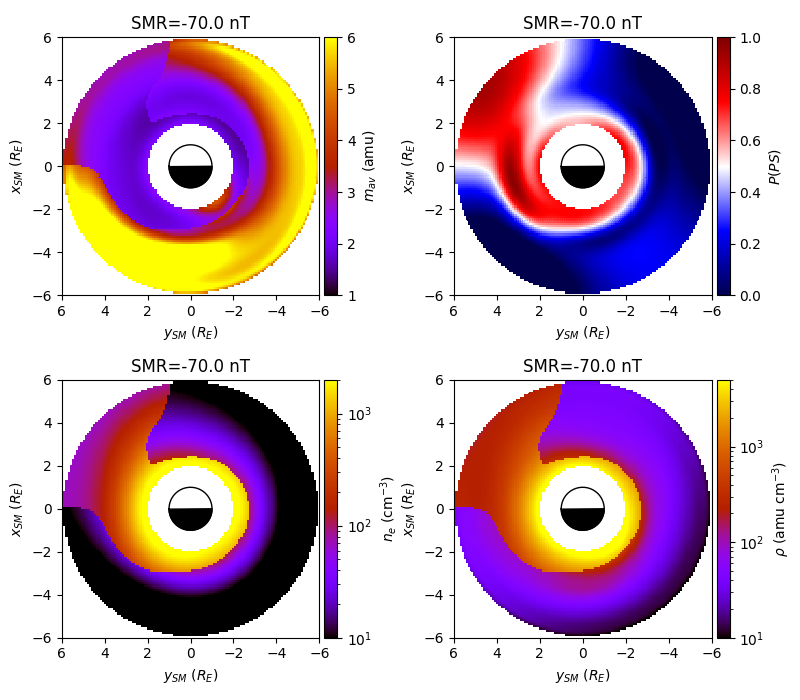

# lsmodel

Python wrapper for the Lomb-Scargle based plasma model.

## Installation

### From Source

Obtain the latest release from https://github.com/mattkjames7/lsmodel

```bash
git clone https://github.com/mattkjames7/lsmodel
cd lsmodel
```

Either install using `setup.py`:

```bash
python3 setup.py install --user
```

or by building a wheel:

```bash
python3 setup.py bdist_wheel
pip3 install dist/lsmodel-XXX.whl --user
```

where `"XXX"` is the rest of the file name, which will vary depending upon the current version.

### Using `pip`

This will download the package from PyPI:

```bash
pip3 install lsmodel --user
```

## Usage

Load `python3` or `ipython3`, and import

```python
import lsmodel
```

### Accessing the models

There are four models, plus two additional combinations of these models:

* Average ion mass, *m<sub>av</sub>*: `lsmodel.Mav`
* Probability of being within the plasmasphere, *P*: `lsmodel.Prob`
* Plasmasphere electron density, *n<sub>e,ps</sub>*: `lsmodel.PS`
* Plasmatrough electron density, *n<sub>e,pt</sub>*: `lsmodel.PT`
* Combined electron density, *n<sub>e</sub>* (a combination of plasmasphere, plasmatrough and probability models): `lsmodel.Density`
* Combined plasma mass density, &rho;: `lsmodel.PMD`  

The average versions of each model can be accessed simply by providing the positions in the equatorial plane where you would like them, e.g.:

```python
#either using SM x and y coordinates
P = lsmodel.Prob(x,y)

#or using MLT (M) and L-Shell (L)
P = lsmodel.Prob(M,L,Coord='ml')
```

The scaled models can be accessed using the same functions, this time including the `SMR` keyword (for `Prob`, `PS`, `PT` or `Density`) or `F107` (for `Mav`) or both (for `PMD`), e.g.:

```python
#electron density
ne = lsmodel.Density(x,y,SMR=-75.0)

#average ion mass
mav = lsmodel.Mav(x,y,F107=150.0)

#plasma mass density, effectively ne*mav
pmd = lsmodel.PMD(x,y,F107=150.0,SMR=-75.0)
```

### Plotting the models

A simple function is included, `PlotEq`, which allows the plotting of any of the models in the equatorial plane. e.g.:

```python
ax = lsmodel.PlotEq(ptype,SMR=-75.0)
```

where `ptype` is used to tell the function which model to plot, available options are: `'mav'|'prob'|'ps'|'pt'|'density'|'pmd'`.

The following code produces a plot with all 6 models when SMR = -75 nT and f10.7 = 180.0 sfu

```python
import matplotlib.pyplot as plt
import lsmodel

#create the plot window
plt.figure(figsize=(8,11))

#set the parameters of the models
f107 = 180.0
smr = -75.0

#plot the average ion mass
ax0 = lsmodel.PlotEq('mav',F107=f107,fig=plt,maps=[2,3,0,0])

#plot probability 
ax1 = lsmodel.PlotEq('prob',SMR=smr,fig=plt,maps=[2,3,1,0])

#plot probability 
ax2 = lsmodel.PlotEq('ps',SMR=smr,fig=plt,maps=[2,3,0,1])

#plot probability 
ax3 = lsmodel.PlotEq('pt',SMR=smr,fig=plt,maps=[2,3,1,1])

#plot probability 
ax4 = lsmodel.PlotEq('density',SMR=smr,fig=plt,maps=[2,3,0,2])

#plot probability 
ax5 = lsmodel.PlotEq('pmd',F107=f107,SMR=smr,fig=plt,maps=[2,3,1,2])

#adjust everything to fit
plt.tight_layout()
```



For more information and options, see the `docstring`: `lsmodel.PlotEq?`


